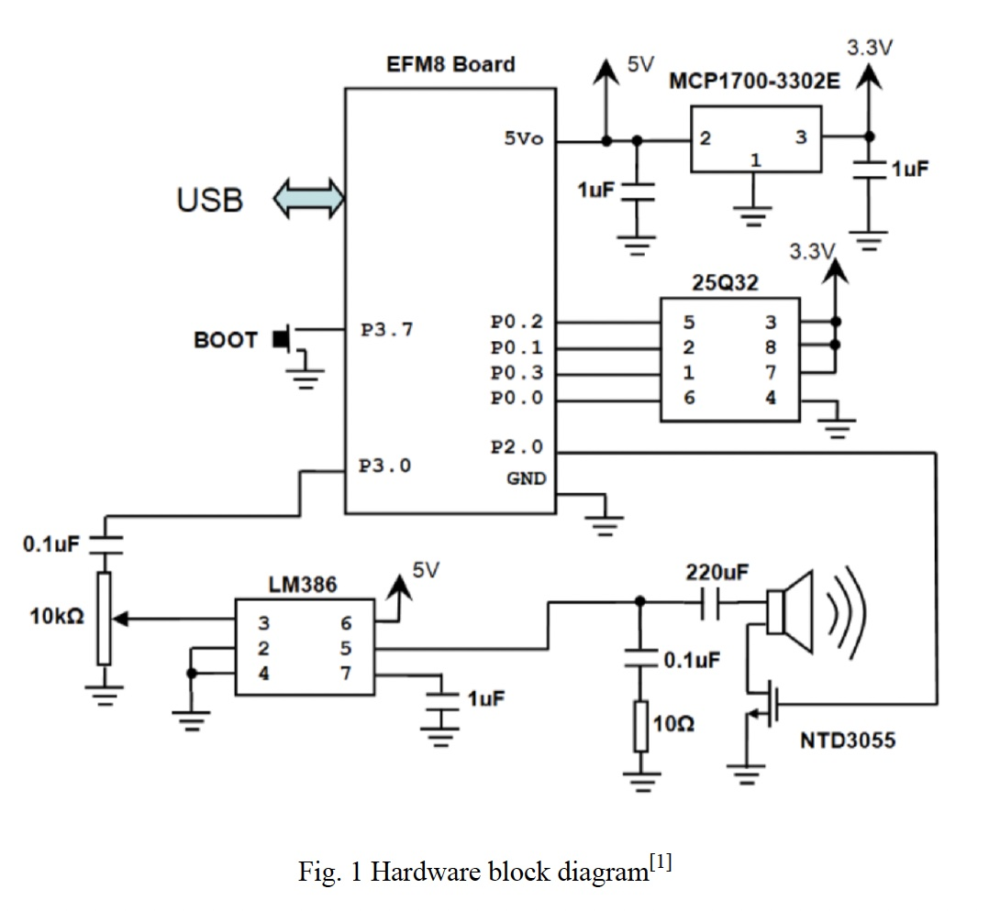
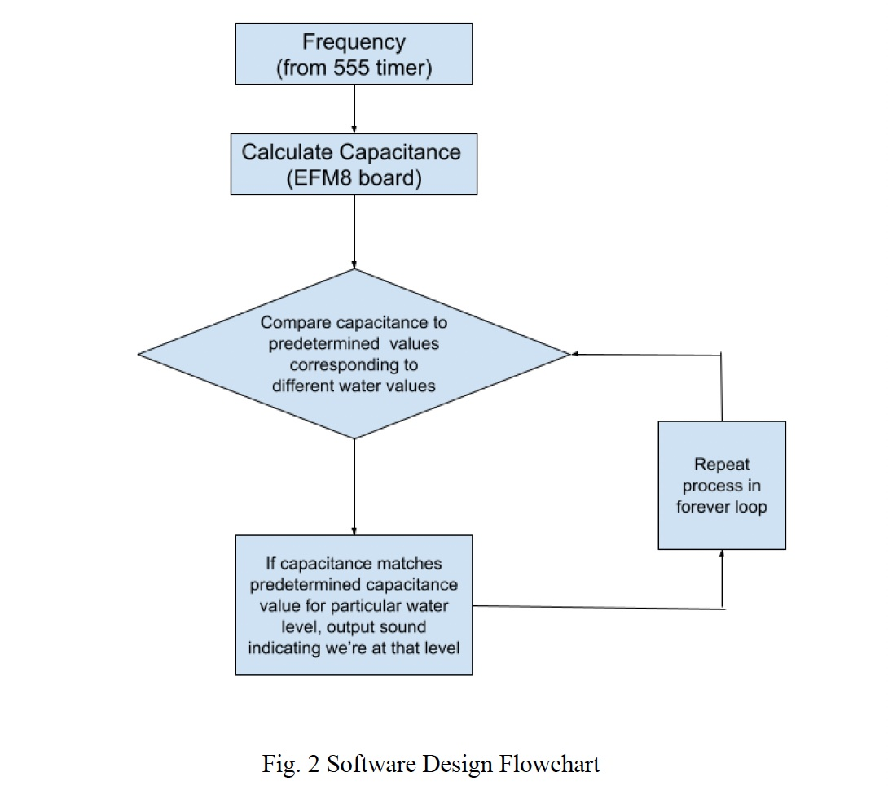
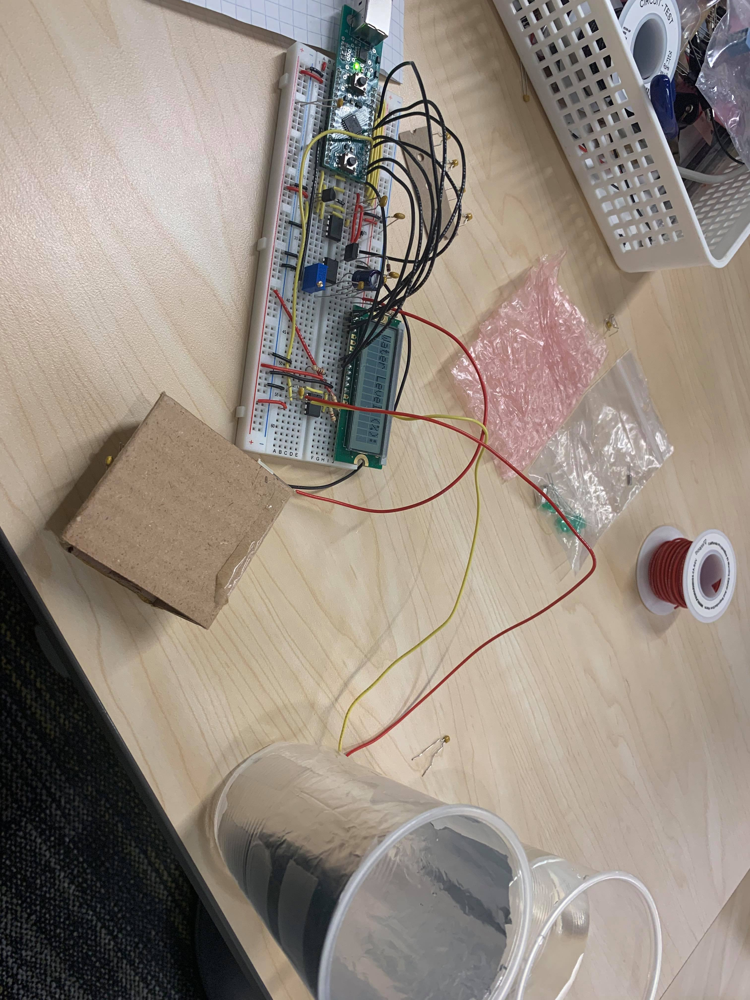

A liquid/water level detector to aid visually impaired people to serve drinks
- Calculated capacitance of the conical plate capacitor that uses water a dielectric and compares this  to the predetermined capacitance of  when the water is 10% pull
- If it matches, call function `tenpercent` that outputs an audio signal through the speakers that water level is 10%.
- Otherwise, continuously compare values loaded and stored until they match the 10% value.
- After 10% is reached, check for 20% and repeat until cup is full while providing audible output for each 10% increment.
- Also built an LCD display that runs on a 72MHz clock, that blinks and displays the  water level at the same time as the voice line.

## Circuit 
- Uses an 8051 based microcontroller (EFM8 board)

1. EFM8 Board: This is the central microcontroller of the system running on 8051 architecture. It also controls the system clock.
2. MCP1700-3320E: A low dropout positive voltage regulator.
3. 25Q32: This is the SPI memory, with a capacity of 32 megabits or 4 megabytes.
4. LM386: A power amplifier designed to amplify the speaker due to the low voltage nature of this system.

## Software 

-  The EFM8 board is programmed in the 8051 Microcontrooler assembly language (`water_level_detector.asm`)

## How it works 
### Hardware
The microcontroller unit (MCU) chosen for this project is the EFM8LB1 from Silabs. This is because it has an excellent Digital to Analog Converter (DAC) which would enable us to add sound to the project. Because encoded sound requires a lot of memory, I used external flash memory for this purpose (25Q32). To measure the water level, I used an LM555 timer configured as an A-stable oscillator, which I simulated to be running at a frequency within 10khz-20khz using a 3kΩ and 2kΩ resistor. The frequency was then used to calculate the capacitance, who’s resulting value would be amplified by the LM386, a power amplifier designed to amplify the speaker. The 220uF capacitor was essential in limiting the energy delivered to the speaker over time, to avoid undesired volumes. The NTD3055 MOSFET transistor allowed for communication between the flash memory and the speaker. 

### Software
The program implements a Serial Port Interface (SPI) communication protocol to program, verify and read the flash memory (25Q32). The flash memory stores a wav sound file containing the different water levels (e.g ‘10%’, ‘20%’,..., ‘90%’, ‘100%’, ‘cup is full’). The program allows us to playback a specific number of bytes from different starting points. This was used as the sound output to the user when the cup was filled with water to different levels. Our program has two timers (timer 0 and timer 2) and we used interrupts to switch between them (Timer0_ISR and Timer2_ISR). Timer2_ISR interrupt vector was used to replay the wave file while Timer0_ISR interrupt vector was used to calculate the frequency of the 555 timer to be used in the capacitance calculation. All of the code runs at 72 MHz including the LCD functions (inside LCD4bit72Hz.inc). The main program first calls the function ‘capacitance_calc’ after initializing the hardware. This function calculates capacitance of the cup+water from the frequency provided by the 555 timer since the frequency output is inversely proportional to the capacitance. I then established a linear relationship between the capacitance output and the water level. This is because the capacitance of a cup full of water is substantially larger than that of an empty cup due to the high permittivity of water. After calculating the capacitance, (in the ‘ten’ function) I check if this value is less than or equal to our predetermined value for 10% water level, if false, call a similar function for 20% (‘twenty’). I continue calling subsequent functions (‘thirty’, ‘fourty’, …, etc.) if none of the value is less than or equal to the predetermined value. If at any point, we determine that the capacitance is equal to one predetermined value, set bit ‘TR2’ to start Timer2_ISR. We then call a corresponding function that outputs sound e.g ‘forty_percent’. This function first stops the timer from playing any previous request and turns off the speaker. We then set the specific point in memory we want to start playing the audio from (e.g for 40% start playing from #0x01,#0x2f,#0x9a). We then set the specific number of bytes that we want to play using variable w. We then call the send_SPI function which is used to send and receive bytes from flash memory. Finally we turn on the speaker, and start playback by setting TR2. Any time we play sound using these functions, we jump to the end of the forever loop using the ‘done’ label. We then long jump back to the start of the forever loop and repeat the process again.

### Video demo

[Youtube link](https://www.youtube.com/watch?v=4QwDmZlB6OQ)

